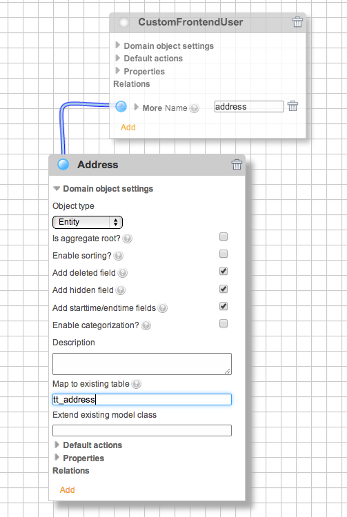

.. include:: ../Includes.txt

Extending models or map to existing tables
==========================================

Extending models
----------------

The ExtensionBuilder supports single table inheritance. That means, you can extend extbase models,
either of your current extension or of other extensions. You have to enter the class name (not the model name!)
of the model you want to extend in the domain object settings form in the field "Extend existing model class".
The class has to be loadable, that means you can only extend classes of extensions that are installed.
After saving and updating the database (if necessary) you should find a dropdown "Extbase Record Type" in
the backend form and a new tab showing the properties that contains the new properties.

.. note::

   Since the single table inheritance depends on the ``$TCA[ctrl][type]`` field, the ExtensionBuilder tries to detect if there
   is already a type field configured and if so extends it with a new item for your new extended model. Otherwise the
   ExtensionBuilder creates a new column ``extbase_record_type`` and configure it as new type field. This might result in
   errors in certain cases. Especially if you don't see any form at all, when opening existing records in the backend,
   have a look at the type field configuration and at the existing values in the type field!

.. figure:: ../Images/Developer/Extend-Frontenduser.png
   :width: 200px
   :align: left
   :alt: Extend Frontend user

Example: Extend frontend user

Mapping to tables
-----------------

Often you want to store your models in an existing table, for example if there is no extbase model for that table yet (like tt_address). Then you can enter the tablename in the domain object settings form in the field "Map to existing table". The ExtensionBuilder will then add fields to that table for each property you added to your model. If you name the properties according to the existing column names you can access the existing fields with the getters and setters of your model and no new columns are generated.

Example: map to table tt_address

.. figure:: ../Images/Developer/Database-Update.png
   :width: 500px
   :align: left
   :alt: DB update

The resulting database updates

.. figure:: ../Images/Developer/Backendform-Frontenduser.png
   :width: 500px
   :align: left
   :alt: Backend form

The backend form for the extended frontend user

.. note::

   **Restrictions for STI (Single table inheritance)**

   You should be aware, that the mapping to an existing table has some side effects: Extbase will store the model in
   the table. When it tries to restore the model, for example if a parameter ``tx_myext_myplugin[modelname]=23`` is
   passed to a controller, it has to find the right subclass. This is implemented by a type field, which is the type
   field defined in ``$GLOBALS[TCA][my_table][ctrl][type]``.
   But in many system table like pages or tt_content the type field is used for different purposes, for example the
   type field of tt_content holds the Content Type of the record and is used to find the right rendering definition for
   that record. Now, when you map your model to tt_content this will add a new type value which has no rendering
   definition at all.

   Another issue related to single table inheritance is, that there is no real implementation in TYPO3 to avoid
   conflicts if multiple extensions extend the same model. If there are 3 extension which extend a news model,
   you have always to decide, which model you will use. You can't use the features of all subclasses in one model.

.. caution::

   Do not use STI of external models in extensions you want to publish in TER. You (and the user who download your extension) have no control of how many other extensions try to extend the same model which will result in unexpected behaviour!

Relations to models of other extensions
---------------------------------------

If you want to add a relation to a model that does not belong to your current extension you have to enter the
class name (not the model name!) of that model in the relations settings form. The related class has to be loadable,
so you can only add models of extensions that are installed.

.. tip::
   Don't forget to add the extension which models you extend in the dependencies field in the left property panel.
   Only then the PackageManager will care for the right order loading the extensions

