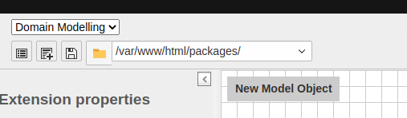

.. include:: /Includes.rst.txt

.. _graphical-editor:

================
Graphical editor
================

To create a TYPO3 extension based on Extbase & Fluid, follow these steps:

1. Open the graphical editor
============================

Go to the Extension Builder backend module,
switch to the graphical editor by selecting the :guilabel:`Domain Modelling`
view (1)
and ensure that the properties form is expanded by clicking on the small arrow
symbol :guilabel:`>|` on the upper left corner (2).

.. figure:: ../Images/UserManual/modeler-start-extension-a.png
   :width: 200px
   :align: left
   :alt: Modeler Start Extension

2. Insert meta data of extension
================================

Enter a meaningful extension name (1), a vendor name (2) (UpperCamelCase) and an
extension key (3) (without spaces and in lowercase).

.. figure:: ../Images/UserManual/modeler-start-extension-b.png
   :width: 500px
   :align: left
   :alt: Modeler Start Example

3. Create a domain model
========================

Then create at least one model by dragging the grey tile "New Model Object"
to the canvas. Give it a meaningful name starting with an uppercase letter.

3.a. Edit domain object settings
--------------------------------

Open the :guilabel:`Domain object settings` and check :guilabel:`aggregate root`
if this model is the root of the other models of your domain.
In general you need at least one aggregate root which has a corresponding
repository to retrieve models from the persistence.
A simple way to find out, if a model is an aggregate root or not, is to consider
if you can retrieve objects of this model by requesting them from another model
or not.
So if you create a blog model and a post model, it is obvious that the blog is
the aggregate root and the post is not. You can retrieve posts by requesting
them from the blog model: ``$blog->getPosts()``.

.. figure:: ../Images/UserManual/modeler-object-settings.png
   :width: 200px
   :align: left
   :alt: Modeler Object Settings

3.b. Add actions
----------------

If the model is an aggregate root, open the :guilabel:`Default actions` panel and
choose actions you need and add custom actions if required.
All selected actions will be made available in the controller which is
created along to the model.

.. figure:: ../Images/UserManual/modeler-actions.png
   :width: 250px
   :align: left
   :alt: Modeler Actions

3.c. Add properties
-------------------

Expand the :guilabel:`properties` subsection.
The name of a property should only contain alphanumerical characters and be of lowerCamelCase format.
The description will be displayed in the TYPO3 backend as a help popover when clicking on the property field.

3.d. Add relations
------------------

If you create multiple models you may want to connect them by relations.
A relation property can be added in the :guilabel:`relations` subsection,
must have a lowerCamelCase name and contain alphanumerical characters only –
like an ordinary property.
When being added, it can be connected to the related model by dragging the round connector
of the relation property and dropping it at the connector of the related model.
When expanding the relation property panel you can select the type of relation:

* **1:1** means you have one property in your model representing one specific object of the related model. For example if you say a person has only one account and that account is not used by anyone else you can define it as 1:1.

* **1:n** means you have a property in your model representing multiple objects of the related model but each of them has no other relation. A blog has multiple posts, but each post only belongs to one blog.

* **n:1** means you have a property in your model representing a single object of the related model, but the related model can have multiple relations. For example, each person has a certain place of birth, but many people can have the same place of birth.

* **m:n** means the property of your model consists of multiple objects of the related model. For example a book can have multiple authors and each author has written multiple books.

Besides that you can choose in the :guilabel:`Render type` select box if you
want to create, link and edit the related objects in the TYPO3 backend
:doc:`inline <t3tca:ColumnsConfig/Type/Inline/Index>`
or create and edit them separately and link in a :doc:`select field <t3tca:ColumnsConfig/Type/Select/Index>`.

4. Create a frontend plugin
===========================

If you want to create an extension that generates output in the TYPO3 frontend,
add a plugin in the subsection :guilabel:`Plugins` of the properties form.
The name should be meaningful and the key be lowercase without spaces.

[TODO]: Where is the description rendered?
[TODO]: Write about controller and actions.

5. Create a backend module
==========================

If your extension should provide a TYPO3 backend module,
you have to add a backend module in the left panel of the modeler.

[TODO]: Where is the description, tab label, main module rendered?
[TODO]: Write about controller and actions.

6. Save the extension
=====================

If your model represents the domain you wanted to implement you can hit the
:guilabel:`Save` button at the top.
The Extension Builder generates all required files for you in a location that
depends on your local setup:

Composer mode
-------------

If you run TYPO3 in :doc:`Composer mode <t3start:Installation/Install>`
you have to provide and configure a local `path repository <https://getcomposer.org/doc/05-repositories.md#path>`_ before you save your extension.
The Extension Builder will read the path from the TYPO3 project :file:`composer.json` and offer it as target path
for saving the extension. Extension Builder will create a symlink :file:`typo3conf/ext/<extension_key>/` to your extension.

[TODO]: Is an additional ``composer require <package-name>`` required?

Legacy mode
-----------

If you run TYPO3 in :doc:`Legacy mode <t3start:Installation/LegacyInstallation>`
the extension will be generated directly at :file:`typo3conf/ext/<extension_key>/`.

Once the extension is saved you should be able to install it in the Extension Manager.

7. Continue developing
======================

Now you can start modifying the generated files in your IDE. If you still want to be able to modify the
model in the graphical editor you have to enable :doc:`/Developer/Roundtrip` before loading the extension
in the Extension Builder again.

[TODO]: Roundtrip link should link to page "Configuration" as soon as it is linkable there.
