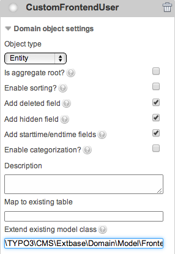
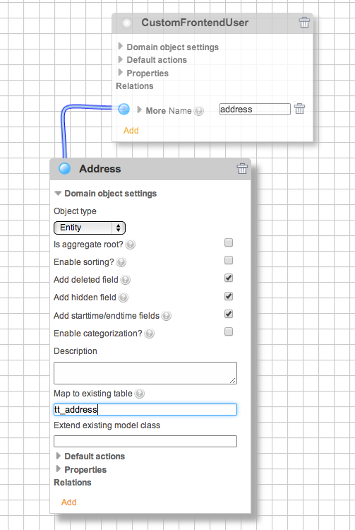
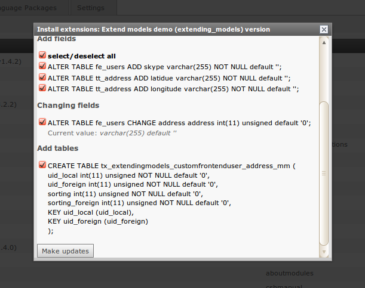
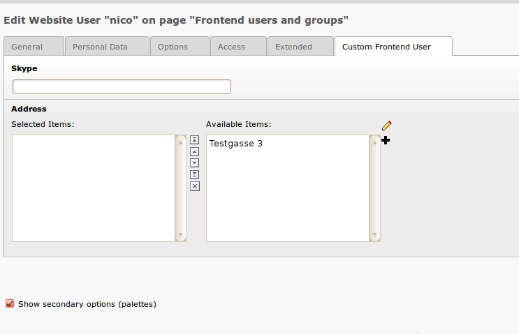

.. include:: /Includes.rst.txt

=========================================================
Extending domain objects or map to existing tables
=========================================================

Since the TYPO3 Core already contains a number of database tables and domain
object classes, it may prove useful to reuse or extend existing domain objects
instead of creating new ones:

.. contents::
   :backlinks: top
   :class: compact-list
   :depth: 1
   :local:

Extending domain objects
========================

The Extension Builder supports *single table inheritance*.
This means you can extend domain object classes, either from your current
extension or from other extensions.
You must enter the fully qualified class name of the domain object you want to
extend in the :guilabel:`Extend existing model class` field in the domain object
settings form.
The class must be loadable, i.e. you can only extend classes of extensions that
are installed. After saving and updating the database (if necessary), you should
find a drop-down list `Record Type` and a new tab with the new properties in the
backend record form.

.. note::

   Since single table inheritance depends on the ``$TCA[ctrl][type]`` field,
   the Extension Builder tries to detect if a type field is already configured,
   and if so, it adds your domain object class as new type.
   Otherwise, the Extension Builder creates a new :sql:`tx_extbase_type` field
   and configures it as a new type field.
   This can lead to errors in certain cases. Especially if you don't see any
   form at all when opening existing records in the backend, look at the type
   field configuration and the existing values in the type field!

In this example, the frontend user domain object was extended:

Mapping to tables
=================

If you want to store a domain object in an existing table, for example if there
is no domain object class for that table yet (like :sql:`tt_address`),
then you can enter the table name in the :guilabel:`Map to existing table`
field in the domain object settings form.
The Extension Builder will then add fields to this table for each property you
added to your domain object. If you name the properties according to the
existing field names, you can access the existing fields with the getters and
setters of your domain object class, and no new fields are created.

In this example the domain object is mapped to table :sql:`tt_address`:

and these are the resulting database updates:

and this is the backend form of the extended frontend user:

.. note::

   **Restrictions for single table inheritance**

   You should be aware that mapping to an existing table has some side effects:
   Extbase stores the class name of the domain object instance in the table.
   When it tries to restore the instance, for example when a parameter
   :samp:`tx_myext_myplugin[objectname]=23` is passed to a controller, it must
   find the correct subclass.
   This is implemented by a type field defined in :php:`$GLOBALS[TCA][<table>][ctrl][type]`.
   But in many TYPO3 Core tables like :sql:`pages` or :sql:`tt_content` the type
   field is used for other purposes, for example the type field of tt_content
   contains the content type of the record and is used to find the correct
   rendering definition for that record. Now when you map your domain object to
   tt_content, a new type value is added that is not a rendering definition.

   Another problem related to single table inheritance is that there is no real
   implementation in TYPO3 to avoid conflicts when multiple extensions extend
   the same domain object. If there are 3 extensions extending a news object,
   you always have to decide which domain object to use. You can't use the
   features of all subclasses in one domain object.

.. caution::

   Do not use single table inheritance from external domain objects in
   extensions that you want to publish in TER and Packagist. Extension users
   have no control over how many other extensions try to extend the same object,
   which will lead to unexpected behavior!

Relations to domain objects of other extensions
===============================================

If you want to add a relation to a domain object that is not part of your
current extension, you must enter the fully qualified class name of that object
in the relation settings form. The related class must be loadable, so you can
only add domain objects from installed extensions.

.. tip::

   Do not forget to enter the TYPO3 extension of the domain object your domain
   object inherits from in the :guilabel:`Depends on` field of the properties
   form.
   Only then the Package Manager will take care of the correct order when
   loading the extensions.
