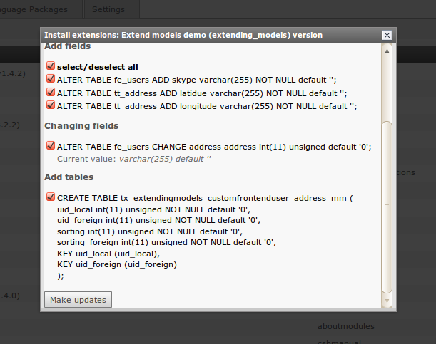

.. include:: /Includes.rst.txt

==========================================
Extending models or map to existing tables
==========================================

Since the TYPO3 Core already contains a number of database tables and Extbase
models, it may prove useful to reuse or extend existing entities instead of
creating new ones:

.. contents::
   :backlinks: top
   :class: compact-list
   :depth: 1
   :local:

Extending models
================

The Extension Builder supports *single table inheritance*.
This means you can extend Extbase models, either from your current extension or
from other extensions. You must enter the fully qualified class name of the
model you want to extend in the :guilabel:`Extend existing model class` field
in the domain object settings form. The class must be loadable, i.e. you can
only extend classes of extensions that are installed. After saving and updating
the database (if necessary), you should find a drop-down list `Record Type` and
a new tab with the new properties in the backend record form.

.. note::

   Since single table inheritance depends on the ``$TCA[ctrl][type]`` field,
   the Extension Builder tries to detect if a type field is already configured,
   and if so, it adds your model as new type. Otherwise, the Extension Builder
   creates a new :sql:`tx_extbase_type` field and configures it as a new type
   field. This can lead to errors in certain cases. Especially if you don`t see
   any form at all when opening existing records in the backend, look at the
   type field configuration and the existing values in the type field!

In this example, the frontend user model was extended:

.. figure:: ../Images/ManualScreenshots/ExtendFrontenduser.png
   :class: with-shadow
   :width: 200px
   :align: left
   :alt: Extend Frontend user

Mapping to tables
=================

If you want to store a model in an existing table, for example if there is no
Extbase model for that table yet (like :sql:`tt_address`), then you can enter
the table name in the :guilabel:`Map to existing table` field in the domain
object settings form.
The Extension Builder will then add fields to this table for each property you
added to your model. If you name the properties according to the existing field
names, you can access the existing fields with your model's getters and setters,
and no new fields are created.

In this example the model is mapped to table :sql:`tt_address`:

.. figure:: ../Images/ManualScreenshots/MapToTtAddress.png
   :class: with-shadow
   :width: 400px
   :align: left
   :alt: Mapping to tt_address

and these are the resulting database updates:

and this is the backend form of the extended frontend user:

.. figure:: ../Images/ManualScreenshots/BackendformFrontenduser.png
   :class: with-shadow
   :width: 500px
   :align: left
   :alt: Backend form of mapped model

.. note::

   **Restrictions for single table inheritance**

   You should be aware that mapping to an existing table has some side effects:
   Extbase stores the model type in the table. When it tries to restore the
   model, for example when a parameter :samp:`tx_myext_myplugin[modelname]=23`
   is passed to a controller, it must find the correct subclass. This is
   implemented by a type field defined in :php:`$GLOBALS[TCA][<table>][ctrl][type]`.
   But in many TYPO3 Core tables like :sql:`pages` or :sql:`tt_content` the type
   field is used for other purposes, for example the type field of tt_content
   contains the content type of the record and is used to find the correct
   rendering definition for that record. Now when you map your model to
   tt_content, a new type value is added that is not a rendering definition.

   Another problem related to single table inheritance is that there is no real
   implementation in TYPO3 to avoid conflicts when multiple extensions extend
   the same model. If there are 3 extensions extending a news model, you always
   have to decide which model to use. You can't use the features of all
   subclasses in one model.

.. caution::

   Do not use single table inheritance from external models in extensions that
   you want to publish in TER and Packagist. Extension users have no control
   over how many other extensions try to extend the same model, which will lead
   to unexpected behavior!

Relations to models of other extensions
=======================================

If you want to add a relation to a model that is not part of your current
extension, you must enter the fully qualified class name of that model in the
relation settings form. The related class must be loadable, so you can only add
models from installed extensions.

.. tip::

   Do not forget to enter the TYPO3 extension of the model your model inherits
   from in the :guilabel:`Depends on` field of the properties form. Only then
   the Package Manager will take care of the correct order when loading the
   extensions.
