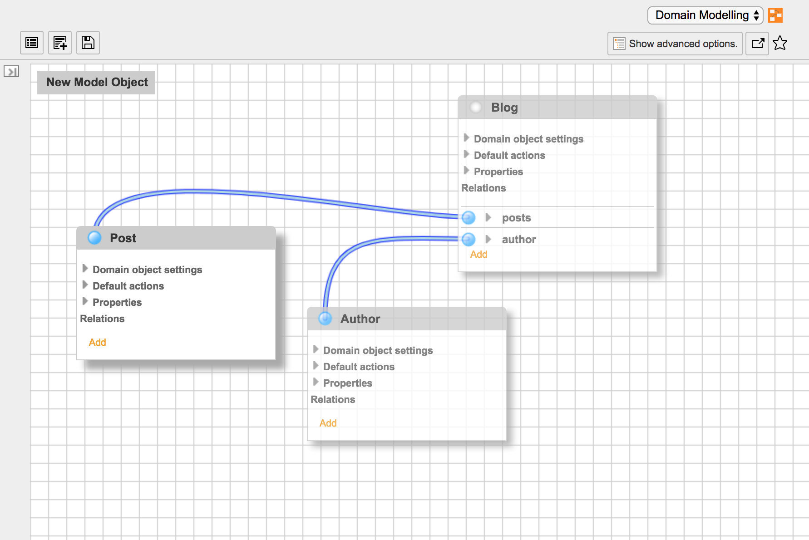

.. include:: ../Includes.txt

.. _introduction:

Introduction
============

The Extension Builder is a tool for TYPO3 extension developers to
ease the implementation of extensions. It provides a "kickstart" mode
to kickstart a simple frontend plugin with basic CRUD (Creat - Read - Update - Delete) functions
(not to be used in production mode) which can be extended and modified to the actual needs

.. _what-it-does:

What does it do?
----------------

The Extension Builder helps you to build TYPO3 extensions based on extbase and fluid.
You can design your model with a graphic modeler and create Plugins or Backend modules.
All required files are generated and you will have a basic extension where you can insert
your domain logic. In contrary to the former kickstarter the extension builder has an edit
mode that enables the continuous use during development. You can modify the autogenerated
classes (add new methods, modify the method bodies, add comments and annotations) and the
extension builder preserves your changes, even if you then rename models or properties in
the modeler.

The ExtensionBuilder is NOT intended to do TYPO3 CMS specific stuff, like extending pages or custom content elements,
as the the old kickstarter. It focuses on extensions development in a sense of `Domain Driven Design <https://de.wikipedia.org/wiki/Domain-Driven_Design>`_

.. _screenshots:

Screenshots
-----------

The Modeler provides a graphical interface to model your Domain

When you click on the "Save" button a complete code base for a TYPO3 extension is generated.
You can install the generated plugins and test the output in the frontend.

