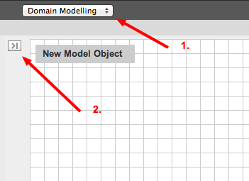
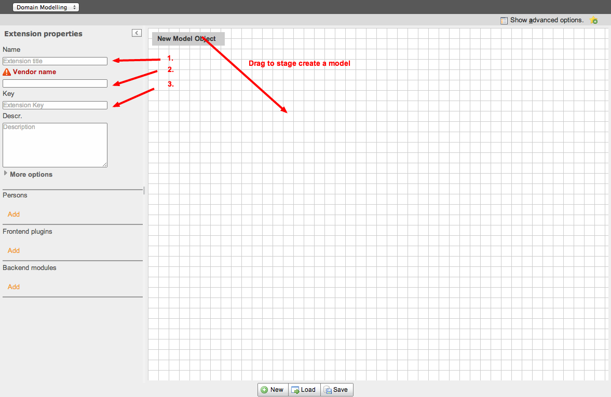
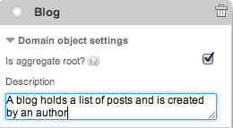

.. include:: ../Includes.txt

.. _user-manual:

Users Manual
============

Target group: **Developers**

Using the Extension Builder
---------------------------

Starting a new extension
------------------------

To create a new Extension, go to the Domain Modelling view (1) and open the left panel by clicking on the small arrow on the upper left corner (2).

1. Create a domain model
------------------------

Enter a meaningful Extension name (1), a `Vendor name <http://docs.typo3.org/flow/TYPO3FlowDocumentation/stable/TheDefinitiveGuide/PartV/CodingGuideLines/PHP.html#naming>`_ (2) (UpperCamelCase) and an extensionKey (3) (without spaces and in lowercase).
You can add a person that will be listed in the generated files as author.

Then create at least one model by dragging it from the grey button "New Model Object" to the canvas.
Give it a meaningful name starting with an uppercase letter.

Open the Domain Settings and check Aggregate root if this model is the root of the other models of your domain.
In general you need at least one aggregate root which has a corresponding repository to retrieve models from the persistence.

.. tip::

   A simple way to find out, if a model is an aggregate root or not, is to consider if you can retrieve objects
   of this model by requesting them from another model or not.
   So if you create a post Model and a Blog model, it is obvious that the Blog is the aggregate root and the
   post is not. You can retrieve posts by requesting it from the blog model: $Blog->getPosts().

Open the action panel and select the options you need. All actions you select will be configured as allowed actions for your plugin.

.. figure:: ../Images/UserManual/modeler-actions.png
   :width: 250px
   :align: left
   :alt: Modeler Actions

.. warning::

   **Security check!**

   Be aware that any action can be called just by adding a parameter to the URL where the plugin is included.
   If you provide an edit/update action link it will look like this:

   http\:\/\/mydomain.de/mypage/?tx_extensionkey_pluginkey[\ **action**\ ]=\ **edit**\ &tx_extensionkey_pluginkey[\ **profile**\ ]=\ **12**

   This will load your edit view (wich contains a form to edit the profile) and load the profile data into it.

   **Beware!** There's no access control by default. If someone manipulates this URL to look like this:

   http\:\/\/mydomain.de/mypage/?tx_extensionkey_pluginkey[\ **action**\ ]=\ **delete**\ &tx_extensionkey_pluginkey[\ **profile**\ ]=\ **23**

   This would delete profile 23 if you forget to implement access checks or other appropriate constraints.

2. Add properties
-----------------

The names of properties of the same model have to be unique, they must start with a lowercase letter, should only contain alphanumerical character and should be written in lowerCamelCase if neccessary.
The description you enter here, will appear in the backend as help text near the property field.

3. Add relations
----------------

If you create multiple models you may want to connect them by relations. A relation should have a lowerCamelCase name like properties and can be
connected to the related model by dragging the mouse from the round connector at the relation property to the connector at the top of the related model.
You should always open the "more" panel to define what kind of relation you want.
These relations are possible:

* **1:1** means you have one property in your model representing one specific object of the related model. For example if you say a person has only one account and that account is not used by anyone else you can define it as 1:1.

* **1:n** means you have a property in your model representing multiple objects of the related model but each of them has no other relation. A blog has multiple posts, but each post only belongs to one blog.

* **n:1** means you have a property in your model representing a single object of the related model, but the related model can have multiple relations. For example, each person has a certain place of birth, but many people can have the same place of birth.

* **m:n** means the property of your model consists of multiple objects of the related model. For example a book can have multiple authors and each author has written multiple books.

Besides that you can decide if you want to edit the related objects in the backend "inline" that is in the form of the "parent" object or as a select field.

4. Create a plugin
------------------

If you want to create an extension that generates output in the frontend create a plugin with a meaningful
name and a lowercase key without spaces.

5. And/Or create a backend module
---------------------------------

If you want a backend module for your extension, you have to add a backend module in the left panel of the modeler

6. Save the extension
---------------------

If your model represents the domain you wanted to implement you can hit the "Save" button at the bottom. The Extension Builder generates all required files for you.
Have a look into :file:`typo3conf/ext/yourExtensionKey/` to see them. Now you can start implementing your logic.

.. caution::
   Please be aware that the generated extension is NOT ready for use in production context!

You can find a more detailed description in the :doc:`/Developer/Index`

If you modified the generated files but still want to modify the model in the graphical interface you have to enable :doc:`/Developer/Roundtrip`
