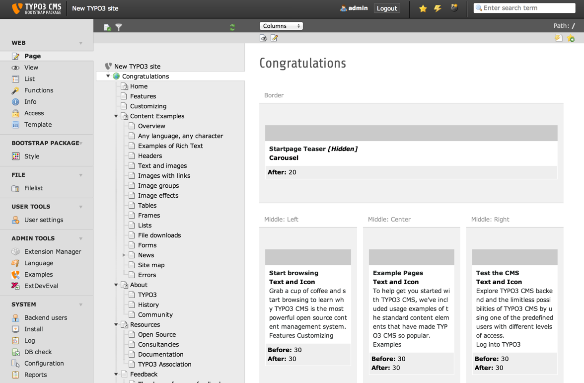

============
Users manual
============

Target group: **Editors**

Here should be described how to use the extension from the editor pespective.

* How it works?
* How to install the plugin on a web page?
* What options are available?

Language should be non-technical, explaining, using small examples. Don't use to many acronyms unless they have been explained. Don't be confusing by putting information targeting administrators.

Provide screenshots of a neutral Backend such as the `Introduction Package`_ for instance. Keep in mind that the User manual chapter is a candidate to be re-used in a larger documentation compilation. Let imagine a company / organisation is generating a specific documentation towards its clients or end users and can possibly take advantage of the `User manual`_.

		Default Backend view (caption of the image)

		The Backend view of TYPO3 after the user has clicked on module "Page". (legend of the image)

FAQ
====

Possible subsection: FAQ

.. _User manual:
.. _Introduction Package: http://demo.typo3.org/
